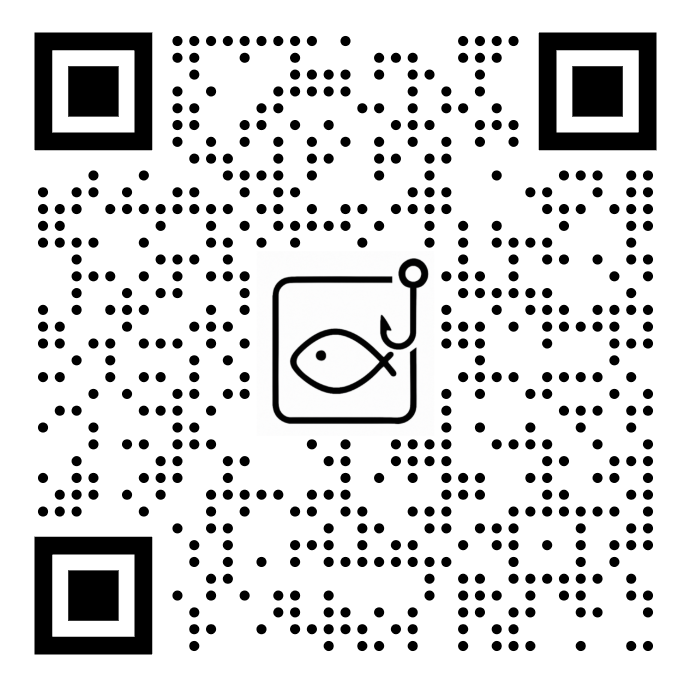
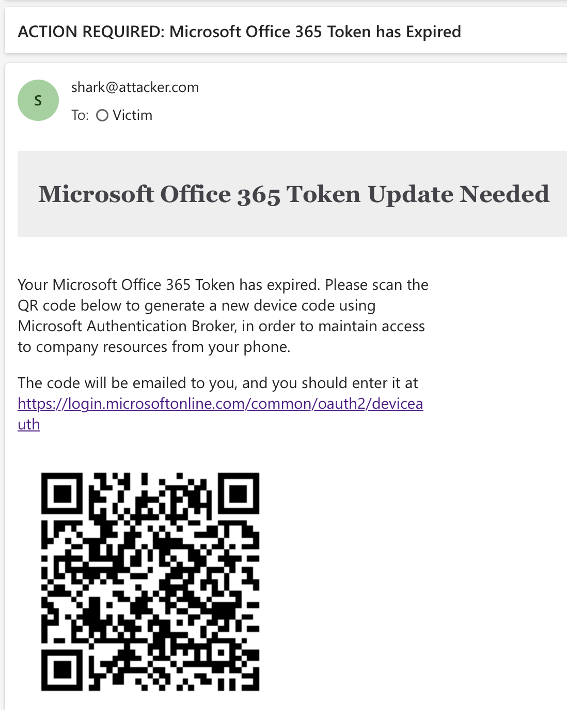
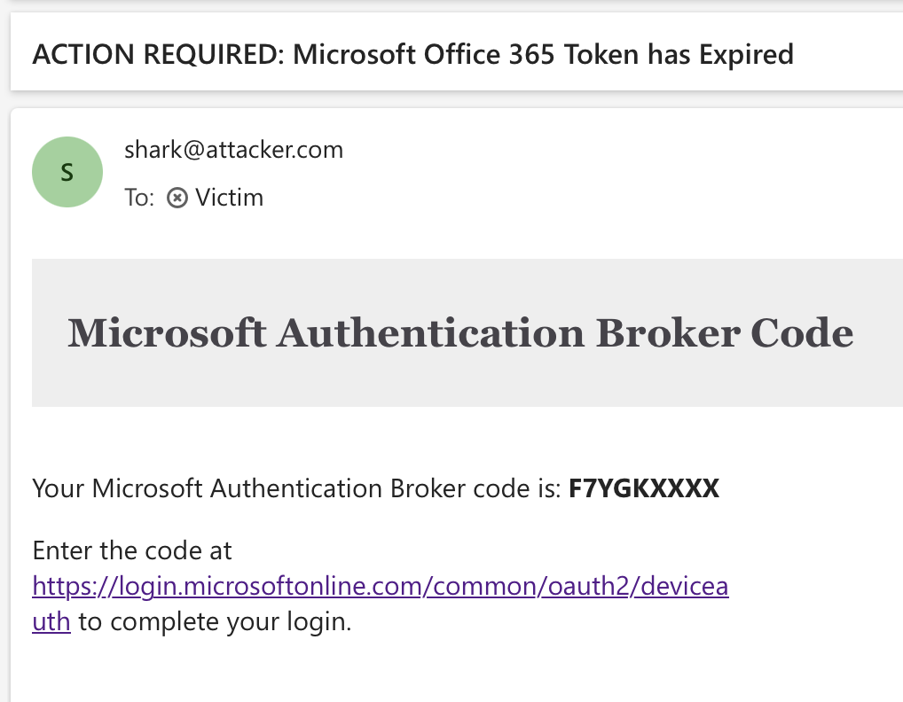
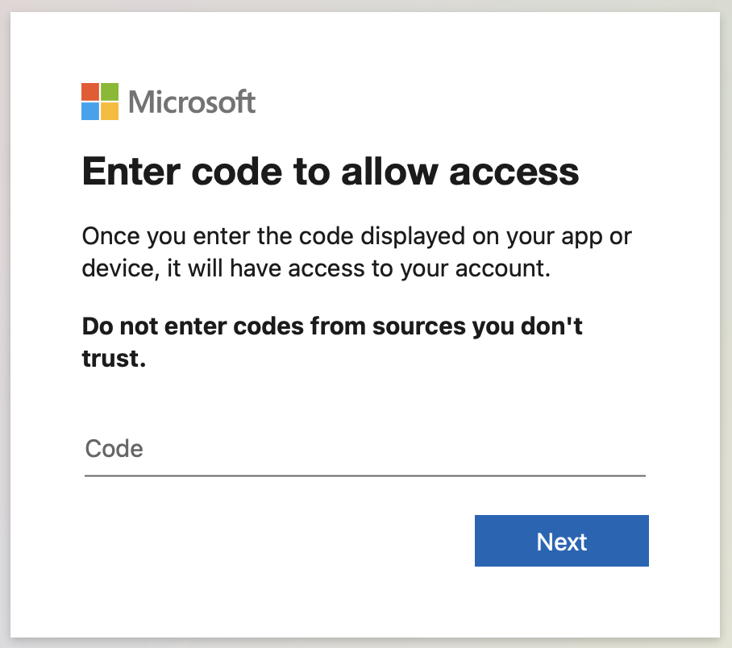
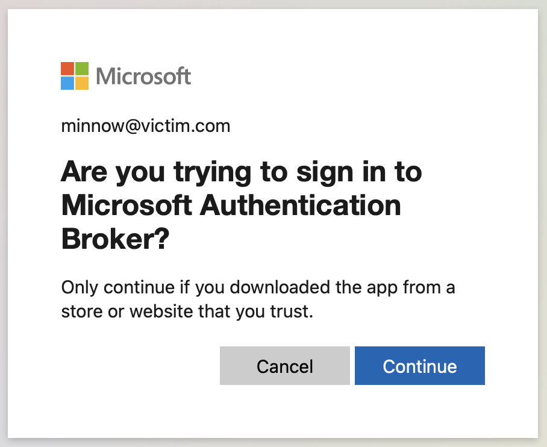
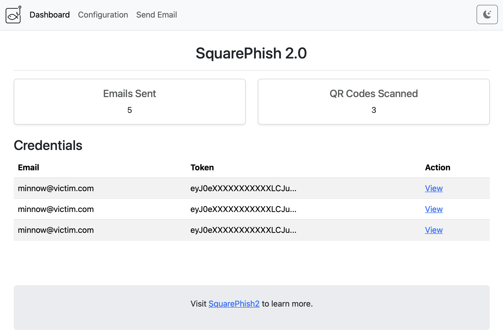
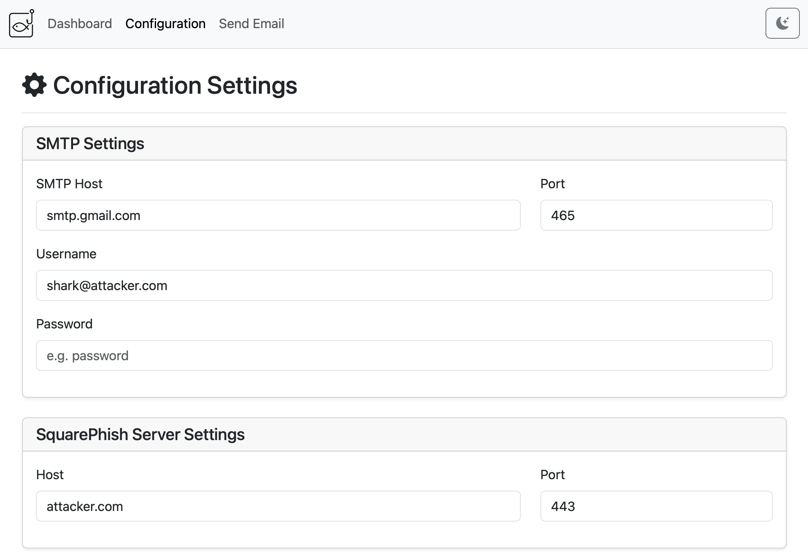
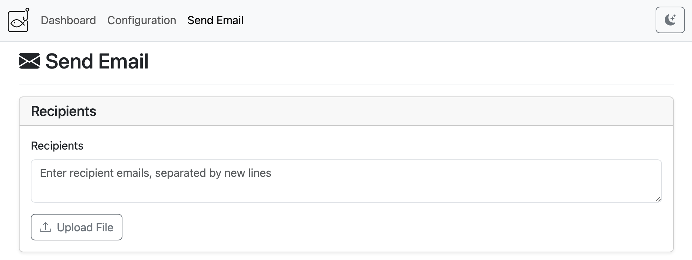
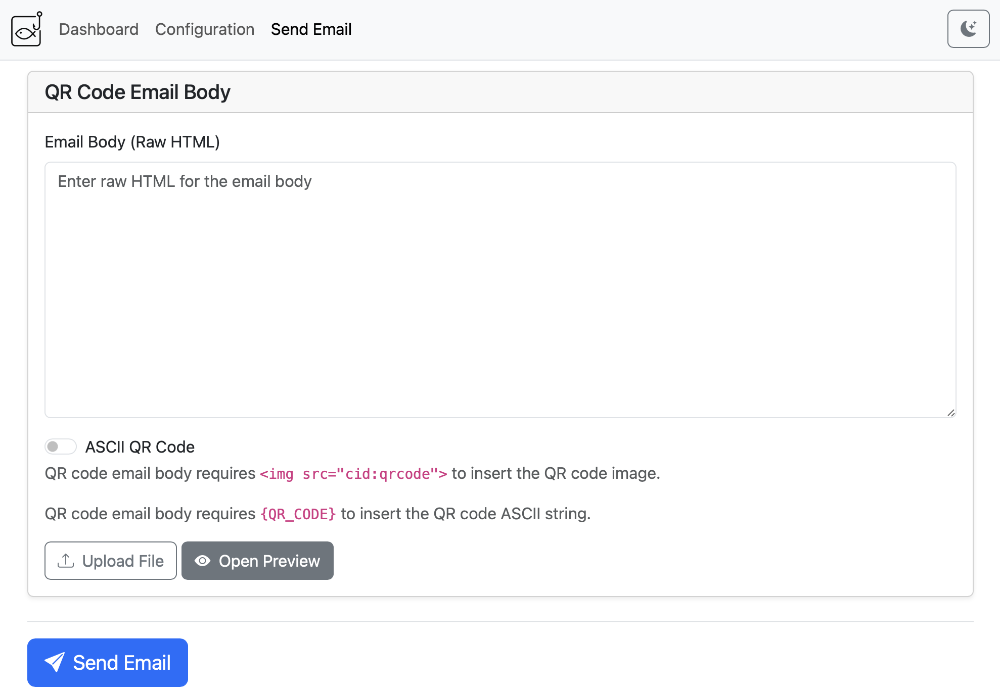

<div align="center">
    </img>
    <h1>SquarePhish 2.0</h1>
</div>

SquarePhish is an advanced phishing tool that uses a technique combining the OAuth Device Code authentication flow and QR codes.

> See [PhishInSuits](https://github.com/secureworks/PhishInSuits) for more details on using OAuth Device Code flow for phishing attacks.

<div align="center">
    <h2>Attack Flow</h2>
</div>

### Step 1: QR Code Email

An attacker will send an initial email to the victim that contains a QR code pointing at the SquarePhish server. The idea behind this is to wait until the user is actively reviewing their email before we trigger the OAuth Device Code flow that has a 15 minute expiration window.

> The current client id is: Microsoft Authentication Broker <br/>
> The current scope is: .default offline_access profile openid

<div align="center">
    </img>
</div>

```
INF[2025/04/20 02:29:30] Email sent to victim(s): minnow@victim.com
```

### Step 2: Victim Scans QR Code

The victim will then scan the QR code found in the email body with their mobile device. The QR code will direct the victim to the attacker controlled SquarePhish server, with a URL paramater set to their email address. Once the SquarePhish server recieves the incoming QR code scan request, the victim will be automatically redirected to Microsoft.

### Step 3: Initiate Device Code Flow

When the SquarePhish server recieves the incoming QR code scan request, the OAuth Device Code authentication flow is intiated. The retrieved 'user code' is then sent via email to the victim where they are directed to enter the code into the legitimate Microsoft Device Code website.

Once the email is sent to the victim, a goroutine is started that continues to poll the Microsoft Device Code endpoint for valid authentication. This will poll until the device code expires (15 minutes).

<div align="center">
    </img>
</div>

```
INF[2025/04/20 02:29:34] [minnow@victim.com] QR Code Scanned
INF[2025/04/20 02:29:34] [minnow@victim.com] Initializing device code flow...
INF[2025/04/20 02:29:34] [minnow@victim.com]     Client ID: 29d9ed98-a469-4536-ade2-f981bc1d605e
INF[2025/04/20 02:29:34] [minnow@victim.com]     Scope:     .default offline_access profile openid
```

### Step 4: Victim Authentication

The victim recieves the second email containing the device user code. The victim then enters the code and continues through the authentication process on Microsoft's Device Code page.

Once valid authentication occurs, the background polling retrieves and saves the access and refresh key data.

<div align="center">
    </img>
    </img>
</div>

```
INF[2025/04/20 02:29:40] [minnow@victim.com] Polling for user authentication...
INF[2025/04/20 02:29:40] [minnow@victim.com] Polling for user authentication...
INF[2025/04/20 02:29:40] [minnow@victim.com] Authentication successful
INF[2025/04/20 02:29:40] [minnow@victim.com] Token retrieved and saved to database
```

<div align="center">
    <h2>Usage</h2>
</div>

> SquarePhish does not have authentication in front of the admin dashboard and as a result should be run behind a firewall and not exposed to the internet.

```
usage: squarephish [<flags>]

Flags:
  -h, --[no-]help             Show context-sensitive help (also try --help-long and --help-man).
  -c, --config="config.json"  Path to the config file
  -v, --[no-]verbose          Enable verbose logging
      --[no-]version          Show application version.

example: ./squarephish --config config.json
```

Modify the included configuration file `config.json` or use the below template:
```json
{
    // This is this internal facing admin dashboard
	"dashboard_server": {
		"listen_url": "127.0.0.1:8080",
		"cert_path": "",
		"key_path": "",
		"use_tls": false
	},

    // This is the internet facing server that a QR scan will point to
	"phish_server": {
		"listen_url": "0.0.0.0:8443",
		"cert_path": "server.crt",
		"key_path": "server.key",
		"use_tls": true
	}
}
```

<div align="center">
    <h3>Dashboard</h3>
</div>

The dashboard view lets the operator view simple metrics relating to the current campaign. Metrics include the number of emails sent, the number QR codes that have been scanned, and a list of credentials retrieved. Each credential can be viewed in a new tab as a JSON object.

<div align="center">
    </img>
</div>

<div align="center">
    <h3>Configuration</h3>
</div>

The configuration pages lets the operator set the core settings for SquarePhish. The following settings are to be configured:
- SMTP host and credentials
- SquarePhish server settings (to be used when generating the initial QR code)
- Subject and Sender for all emails (QR code and device code)
- The device code email body template (used automatically when a QR code is scanned)

<div align="center">
    </img>
</div>
<br/>
<div align="center">
    </img>
</div>

<div align="center">
    <h3>Send Email</h3>
</div>

The send email page lets an operator specify a recipient and an initial QR code email template. The operator can then send emails to all recipient(s).

<div align="center">
    </img>
</div>
<br/>
<div align="center">
    </img>
</div>

<div align="center">
    <h2>Primary Refresh Token</h2>
</div>

When using the `Microsoft Authentication Broker` client id, an attacker can take the returned refresh token and convert it into a Primary Refresh Token (PRT) using the included [gimmePRT](scripts/gimmePRT/) Python tool.

<div align="center">
    <h2>Custom Pretexts</h2>
</div>

Currently, SquarePhish provides several pretext references that can be found in the [pretexts](pretexts/) folder.

> **Important**: When writing a custom pretext, note the required data for the following emails:
- **QR Code Email**: Include `` for QR image insertion.
- **ASCII QR Code Email**: Include `{QR_CODE}` for QR image insertion.
- **Device Code Email**: Include `{DEVICE_CODE}` for device user code insertion.

<div align="center">
    <h2>SquarePhish 1.0</h2>
</div>

The original version of SquarePhish, written in Python, is [hosted here](https://github.com/secureworks/SquarePhish).